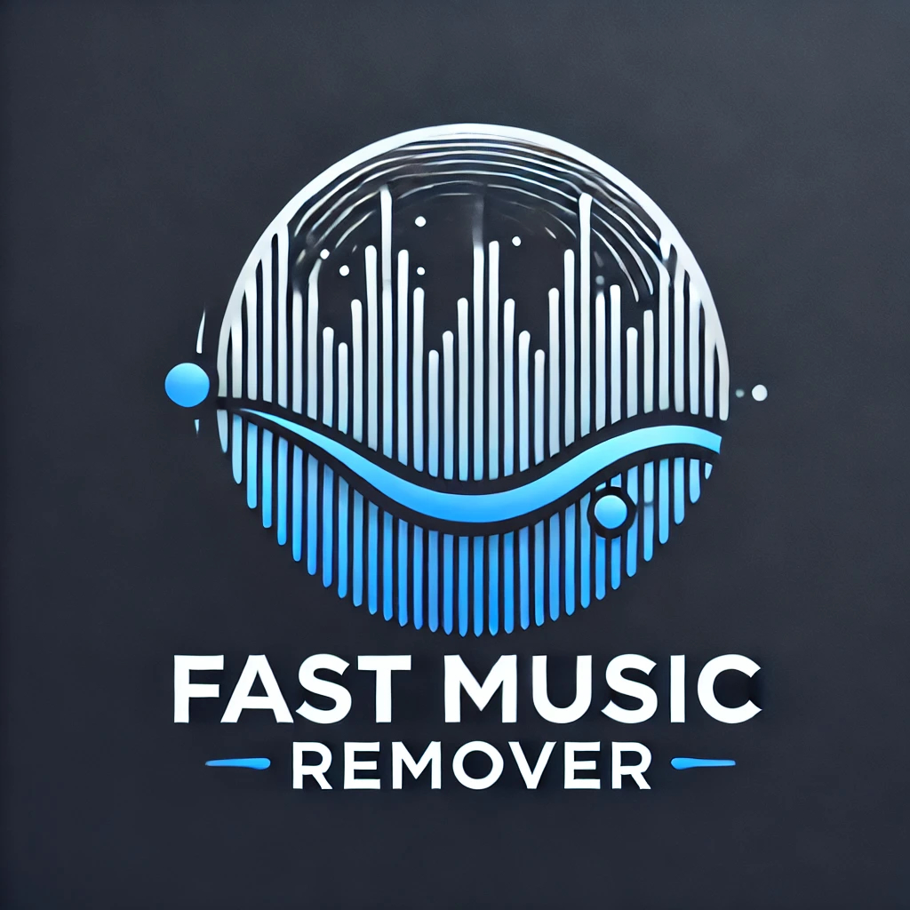
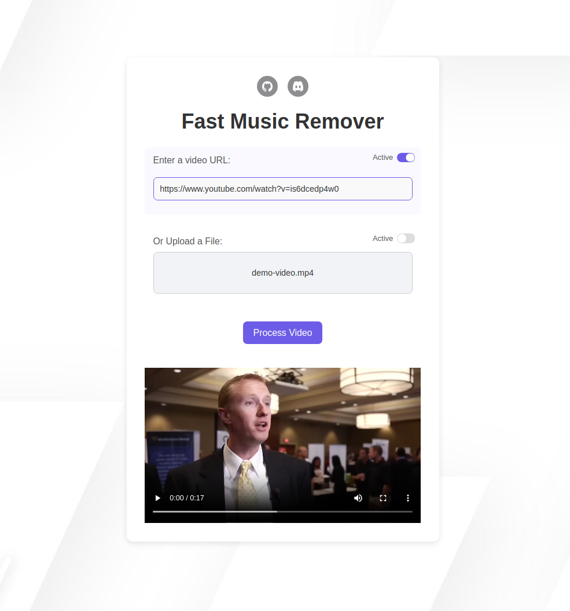

<div align="center">



# Fast Music Remover

### *Take control of the media you consume every day with **Fast Music Remover***!

</div>

<div align="center">

  [](https://github.com/omeryusufyagci/fast-music-remover/blob/main/LICENSE)
  [](https://github.com/omeryusufyagci/fast-music-remover/issues)
  [](https://github.com/omeryusufyagci/fast-music-remover/actions/workflows/build_test_and_format_core.yml)
  [](https://ghcr.io/omeryusufyagci/fast-music-remover:latest)
  [](https://discord.gg/xje3PQTEYp)

</div>

We consume, willingly or not, large amounts of media everyday, and that includes content that is emposed on us. `Fast Music Remover` gives you **the choice to opt-out** of them without missing out on the core content.

We're building a feature rich media processor that is efficient, modular and cross platform. It's being built for you! That means clean APIs for programmers, [containerized on GHCR](https://github.com/omeryusufyagci/fast-music-remover/pkgs/container/fast-music-remover) for remote users, with a Web UI providing seamless access to anyone interested!

Today, we support background music filtering and noise removal to enhance audio quality. In the near future, we plan to expand our capabilities by adding support for more ML models and DSP modules, as well as introducing realtime processing to empower you with the tools to take control of the media you consume.

If this resonates with you, consider [contributing](CONTRIBUTING.md)!

## UI & Demo Video

We offer a minimalistic UI to streamline access to the `MediaProcessor`'s core features.

<div align="center">
  
</div>

---

<div align="center">

https://github.com/user-attachments/assets/e46c161b-0178-4213-b468-245e9f829d5e

</div>

> The [original interview video](https://www.youtube.com/watch?v=aujFci9AuXE) is by Fisher College of Business, licensed under a [Creative Commons Attribution license (reuse allowed)](https://support.google.com/youtube/answer/2797468?hl=en).


## Roadmap

Our immediate priority is to provide a stable first release with cross-platform support for Linux, macOS, and Windows. We’re focused on getting this early version out as soon as possible, and your feedback will help shape the direction of the project.

In parallel, we're developing cross-platform tooling to simplify manual setup for enthusiasts and contributors. The first release will feature a project launcher to manage dependency installation, project configuration, and starting the web application, handling all [prerequisites](#prerequisites) locally for you. This will be offered in addition to our [stable image on GHCR](#using-the-pre-built-image).

Following the first release, we plan to introduce a separate, unstable release with some features in alpha stage, such as realtime processing. At this stage, we'll also experiment with new ML models to expand the capabilities of our processing engine. Let us know if you have any requests!

## Contributing

We have a wide array of interesting technical challenges spanning multiple domains. Take part in building a free and open tool that directly addresses real-world challenges!

Check out our [contributing guidelines](CONTRIBUTING.md) for details on how to get started.

## Prerequisites

> [!TIP]
> If you're just looking to test `Fast Music Remover`, you can skip these prerequisites and jump straight to the [Docker Quick Start](#option-1-quick-start-with-docker) below!

To get started with `Fast Music Remover`, ensure that you have the following software installed on your system. These dependencies are necessary for running the backend server, compiling the C++ processor, and handling media files.

- **Python 3.9+**: Required for running the backend server.
- **FFmpeg**: For extracting, probing, and processing audio files.
- **CMake**: Needed to compile the C++ `MediaProcessor`.
- **nlohmann-json**: A JSON library required for parsing configuration files in the `MediaProcessor`.
- **libsndfile**: Required for sampled audio file operations in the `MediaProcessor`.
- **Docker and Docker Compose** (optional but recommended for a quick setup):

<details>
  <summary>Click here for installation commands for Ubuntu/Debian and macOS</summary>

  ### Installation Commands

  **FFmpeg**:
  - **On Ubuntu/Debian**: 
    ```sh
    sudo apt update
    sudo apt install ffmpeg
    ```
  - **On macOS**:
    ```sh
    brew install ffmpeg
    ```

    After installing FFmpeg, ensure the correct path is set in the `config.json` file. By default, it is set to `/usr/bin/ffmpeg`. If you are using macOS and installed FFmpeg via Homebrew, update the path in `config.json` to:

    ```json
    "ffmpeg_path": "/opt/homebrew/bin/ffmpeg"
    ```

  **CMake**:
  - **On Ubuntu/Debian**: 
    ```sh
    sudo apt update
    sudo apt install cmake
    ```
  - **On macOS**:
    ```sh
    brew install cmake
    ```

  **nlohmann-json**:
  - **On Ubuntu/Debian**: 
    ```sh
    sudo apt update
    sudo apt install nlohmann-json3-dev
    ```
  - **On macOS**:
    ```sh
    brew install nlohmann-json
    ```

  **libsndfile**:
  - **On Ubuntu/Debian**: 
    ```sh
    sudo apt update
    sudo apt install libsndfile1-dev
    ```
  - **On macOS**:
    ```sh
    brew install libsndfile
    ```

  **Docker and Docker Compose**:
  - **On Ubuntu**:
    ```sh
    sudo apt install docker.io docker-compose
    ```
  - **On macOS**:
    ```sh
    brew install docker
    brew install docker-compose
    ```

</details>

> [!IMPORTANT]
> Ensure all the above dependencies are installed before proceeding with the setup.

## Getting Started

To get started with `Fast Music Remover`, you have two options: running it directly via the provided Docker image or installing all the necessary dependencies manually.

### Option 1: Quick Start with Docker

> [!IMPORTANT]
> Ensure Docker is installed by running:
> ```sh
> docker --version
> ```

With Docker, you have two options to quickly try `Fast Music Remover`:

#### 1. **Using the Pre-Built Image**:
Pull the prebuilt image from the registry:

```sh
docker pull ghcr.io/omeryusufyagci/fast-music-remover:latest
```
Run the container:
```sh
docker run -p 8080:8080 ghcr.io/omeryusufyagci/fast-music-remover:latest
```

#### 2. **Building the Image Locally**:

```sh
docker-compose up --build
```
> [!NOTE]
> You may need `sudo` to run this command, depending on how your system is setup.

Once the container is running, open `http://localhost:8080` on your browser, and you can test it right away by submitting a URL or uploading a file from your local machine.

#### What this Docker Setup Includes:
Whether you use the prebuilt image or build it locally, the containerized setup includes:

* A [Flask backend](https://github.com/omeryusufyagci/fast-music-remover/blob/main/app.py) to manage requests.
* The [MediaProcessor](https://github.com/omeryusufyagci/fast-music-remover/tree/main/MediaProcessor) (C++ binary).
* A [minimalistic frontend](https://github.com/omeryusufyagci/fast-music-remover/blob/main/templates/index.html) for submitting and testing media, i.e. audio or video, both supported!

Once processing is finished, the frontend will provide a playback of the processed media.

### Option 2: Manual Installation

For those who want more control or are looking to contribute, follow these steps to set up `Fast Music Remover` manually.

#### Step 1: Ensure Dependencies Are Installed

Ensure all dependencies mentioned in the [Prerequisites](#prerequisites) section are installed before proceeding.

#### Step 2: Install Python Dependencies

Install the Python dependencies with:
```sh
pip install -r requirements.txt
```
#### Step 3: Compile the Media Processor

1. Navigate to the `MediaProcessor` directory:
```sh
cd MediaProcessor
```

2. Make a build directory and navigate into it:

```sh
mkdir build
cd build
```
3. Run CMake and compile (release build by default)
```sh
cmake ..
make
```
> [!NOTE]
> If you encounter errors here, double-check that all prerequisites are installed.

#### Step 4: Start the Backend Server

After setting up the dependencies and compiling the C++ project, **navigate back to the project root** and start the backend server:
```sh
python3 app.py 
```
> [!TIP]
> The server should be accessible at http://127.0.0.1:8080. Open this address in a web browser to get started.

## License

`Fast Music Remover` is released under the MIT [license](LICENSE).